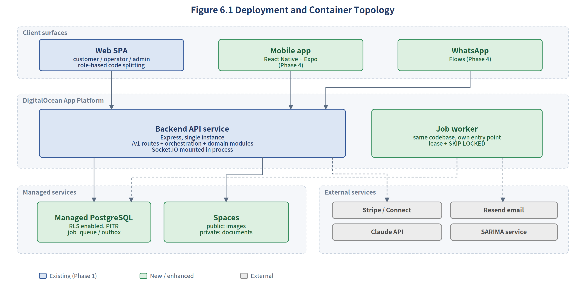
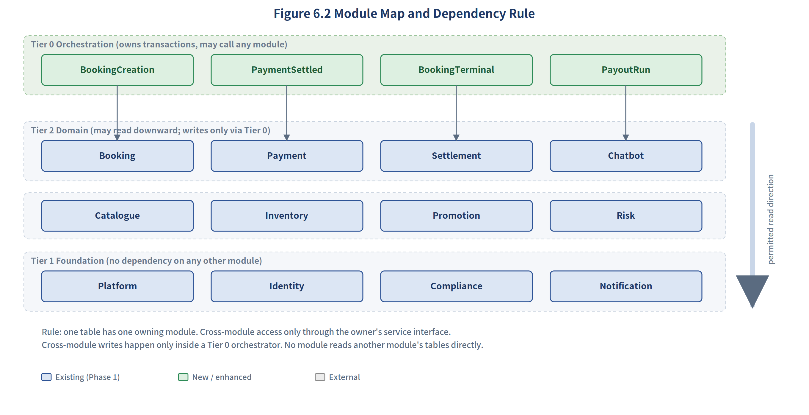
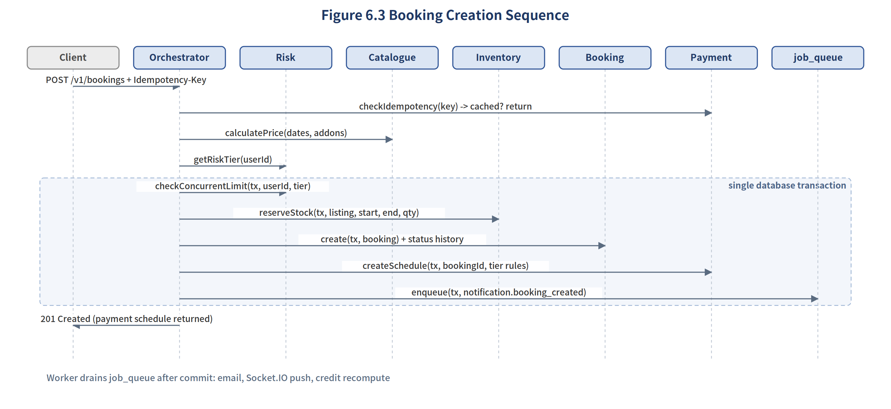
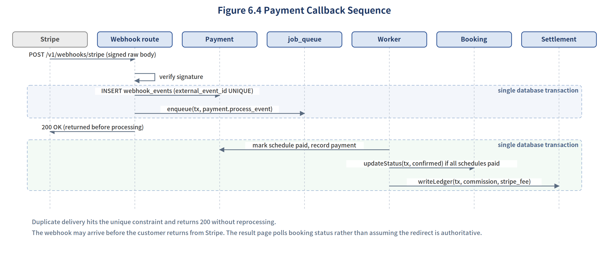
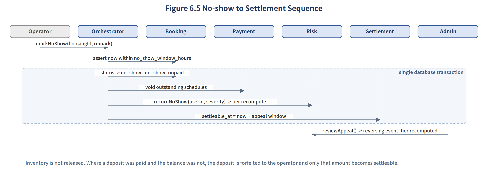

<!-- Extracted from SRS V2.4. Master copy is the DOCX; regenerate rather than hand-edit. -->

# 6. System Architecture

Sections 3 to 5 define what the system must do and what it must store. This section defines how the code is organised, how it behaves at runtime, how it is deployed, and which architectural options were deliberately rejected. It exists because a data model and a feature list do not by themselves prevent four people building six verticals in six weeks from producing a codebase that nobody can safely change by week 5.

## 6.1 Architectural Style

The system is a modular monolith. All business logic runs inside one deployable backend service, divided into modules with enforced boundaries, with a single relational database. This is a deliberate choice rather than a default, and the reasoning together with what it costs is recorded in 6.8.



## 6.2 Module Boundaries and the Dependency Rule

The backend is divided into twelve domain modules and a thin orchestration layer above them. Modules are organised by business domain rather than by technical layer, so that a change to how bookings work touches one module rather than a controller folder, a service folder and a repository folder simultaneously.



### 6.2.1 Table Ownership

Every table in Section 5 belongs to exactly one module. A table with no owner, or with two, is a defect to be fixed before code is written, because it is the point at which the boundary rule stops being enforceable.

| Module | Responsibility | Owned Tables |
| --- | --- | --- |
| Platform (Tier 1) | Global and per-operator configuration, feature flags, audit trail, scheduled task logging, the job queue | system_settings, operator_settings, feature_flags, audit_logs, cron_job_logs, job_queue |
| Identity (Tier 1) | Operator organisations, accounts, authentication, platform and merchant roles, multi-channel identity | operators, users, user_platform_roles, operator_members, user_identities |
| Compliance (Tier 1) | Consent records, structured document management and verification | user_consents, documents |
| Notification (Tier 1) | In-app messages, email and push dispatch, delivery logging | notifications, notification_logs |
| Catalogue (Tier 2a) | Listings, images, add-ons, locations, pricing rules, reviews, favourites | listings, listing_images, listing_addons, locations, listing_locations, rate_rules, reviews, user_favorites |
| Inventory (Tier 2a) | Daily availability, range-atomic reservation and release, horizon generation | listing_availability |
| Promotion (Tier 2a) | Campaigns, promotion codes, funding rules, redemption records | promotions, promo_redemptions |
| Risk (Tier 2a) | Credit scoring, tier resolution, exposure limits, credit events and appeals | customer_risk_profiles, customer_risk_events |
| Booking (Tier 2b) | Booking lifecycle, status transitions, add-on selection, cancellation policy resolution | bookings, booking_status_history, booking_addons, cancellation_policies |
| Payment (Tier 2b) | Payment schedules, payment records, refunds, invoices, callback persistence, idempotency | payment_schedules, payments, refunds, invoices, webhook_events, idempotency_keys |
| Settlement (Tier 2b) | Commission calculation, ledger, payout generation, Stripe Connect accounts | operator_payout_accounts, commission_ledger, payouts, payout_items |
| Chatbot (Tier 2c) | Rule engine, LLM invocation, escalation, conversation persistence | chat_conversations, chat_messages, chat_escalations |

### 6.2.2 The Development Covenant

The following five rules are produced in Phase 0 and agreed by the whole team before implementation begins. They are the contract that makes parallel development possible.

1. One table, one owner. Only the owning module reads or writes its tables directly.
2. Cross-module access goes through the owner’s service interface. If Risk needs booking data it calls a Booking service function; it never issues a Prisma query against bookings.
3. Cross-module writes happen only inside a Tier 0 orchestrator. A domain module never calls another domain module’s write method. The orchestrator opens the transaction, calls each module in turn, and commits.
4. Reads may only travel downward through the tiers: Tier 2c to Tier 2b to Tier 2a to Tier 1. A read that needs to travel upward is a signal that the data should have been passed in by the orchestrator instead.
5. Layering within a module is route, then service, then data access. Business logic lives only in the service layer. Controllers validate input and shape responses, nothing more.

> The last rule is not abstract for this project. The Phase 1 booking controller performed identifier type coercion inside the controller, producing silent Prisma failures, and Checkout.jsx allowed the Stripe step to be bypassed entirely. Both are the same defect: business rules implemented at the wrong layer, where nobody thinks to test them.

### 6.2.3 Why Orchestration Rather Than Direct Calls

An earlier draft of this architecture placed Risk at the bottom of a strict downward dependency chain running from Identity through Booking and Payment to Risk. That chain cannot be implemented, because the dependencies genuinely run in both directions.

- Booking creation must ask Risk for the credit tier and the exposure limit before the booking row exists, so Booking depends on Risk
- Credit recomputation and no-show recording need booking outcomes, so Risk depends on Booking
- The credit tier determines the payment schedule, but payment_schedules is owned by Payment, so Risk would have to call upward into Payment

Three of twelve modules would sit in a dependency cycle from the first day, and a rule that cannot be followed is a rule the team will quietly abandon. Orchestration resolves this by separating two different kinds of call. Downward synchronous calls are queries against policy: Booking asks Risk what tier applies, and Risk answers from its own tables without touching bookings. Upward flow becomes event reaction: the orchestrator writes a job when a booking reaches a terminal state, and Risk consumes it asynchronously. Risk therefore never reads the bookings table at all, the cycle disappears, and the counters in customer_risk_profiles are maintained incrementally from the events rather than recomputed by scanning orders.

The alternative, passing a transaction handle between modules that call each other directly, was rejected because it spreads the booking flow across five modules with no single place to read it, and makes every service signature transaction-aware whether or not it needs to be.

## 6.3 Runtime Architecture

### 6.3.1 Synchronous Path

Requests that the user is waiting on run synchronously: request, authentication and authorisation, orchestrator, one database transaction, response. Everything requiring strong consistency stays on this path, specifically inventory reservation, exposure checking, booking creation, payment schedule generation and status transitions.



Three details in Figure 6.3 matter. Pricing, promotion validation and tier lookup happen before the transaction opens, because they are reads and holding a transaction open across them would lengthen the window during which inventory rows are locked. The exposure check and the inventory reservation are inside the same transaction, because checking a limit in one transaction and acting on it in another is not a limit. The notification is enqueued inside the transaction rather than sent, which is the outbox behaviour described in 6.3.3.

### 6.3.2 Asynchronous Path

**Requirement ID:** FR-ARCH-001

Sections 3 and 4 use the word asynchronously in several places without naming a mechanism. In practice an unnamed asynchronous requirement becomes either a floating promise that is lost on the next deployment, or a synchronous call that blocks the user. Both outcomes have to be designed out.

The mechanism is a PostgreSQL-backed job queue drained by a single worker. No Redis, no message broker, and therefore no additional infrastructure to operate or pay for.

| Field | Purpose |
| --- | --- |
| id, job_type | credit_recompute, notification_send, socket_push, llm_call, payout_generate, availability_extend, payment_process_event |
| payload (jsonb) | Job arguments, including the tenant context the job must run under |
| status | pending, processing, completed, failed |
| claimed_at, lease_expires_at | Visibility timeout. A job whose lease has expired is reclaimed, so a crashed or redeployed worker does not strand work |
| retry_count, next_retry_at | Exponential backoff, maximum five attempts |
| error_message | Last failure reason, retained for diagnosis |

Jobs are claimed with a single statement so that concurrent workers, if the service is ever scaled, cannot claim the same row.

```
UPDATE job_queue SET status = 'processing',
       claimed_at = now(), lease_expires_at = now() + interval '5 minutes'
 WHERE id IN (
   SELECT id FROM job_queue
    WHERE (status = 'pending' AND next_retry_at <= now())
       OR (status = 'processing' AND lease_expires_at < now())
    ORDER BY created_at
    FOR UPDATE SKIP LOCKED LIMIT 10
 ) RETURNING *;
```

- Every handler must be idempotent, because a lease expiry can cause a job to run twice. A notification handler therefore checks notification_logs before sending rather than assuming a single delivery
- A job that fails five times moves to failed and appears in an administrator queue. A failed row that nobody looks at is an undelivered notification the team believes was sent
- The worker is a separate entry point in the same codebase, started as its own process. It is deployed in-process for this project, and the reasoning is in 6.8

### 6.3.3 Outbox Behaviour

**Requirement ID:** FR-ARCH-002

Outbound notifications and third-party calls are written to job_queue inside the same transaction as the business data that triggered them. If the transaction commits, the job exists; if it rolls back, so does the job. This removes the failure where a booking is created and its confirmation email is lost because the process restarted between the commit and the send.

> An earlier draft proposed a separate outbox table alongside the job queue. They are structurally identical: durable rows written inside a business transaction and drained by a worker. Maintaining both would mean two polling loops, two retry policies and a recurring argument about which table a given task belongs in. One table serves both purposes. notification_logs remains the record of what was actually delivered; job_queue is what is still owed.

### 6.3.4 Payment Callback Handling



The webhook endpoint does the minimum: verify the signature against the raw request body, insert the event into webhook_events, enqueue a processing job, and return 200. Processing happens in the worker. This keeps the response fast, which matters because payment providers retry endpoints that respond slowly, and it means a bug in commission calculation cannot cause Stripe to consider the delivery failed.

- Duplicate delivery is caught by the unique constraint on external_event_id and returns 200 without reprocessing
- The webhook can arrive before the customer returns from the payment provider. The result page therefore polls booking status rather than treating the redirect as authoritative, and displays a processing state in between
- Signature verification requires the unparsed request body, so the webhook route is registered before any JSON body-parsing middleware

### 6.3.5 No-show and Settlement Flow



The no-show flow is shown separately because it is the one place where booking status, payment schedules, inventory, credit and settlement eligibility all change together, and where getting the ordering wrong produces a booking that is settleable for money never collected. All five effects occur in one transaction driven by one orchestrator.

## 6.4 Security Architecture

### 6.4.1 Enforcing Row-Level Security

**Requirement ID:** FR-ARCH-003

FR-SEC-002 requires that every tenant-scoped query run inside a transaction that first sets the tenant context. Relying on developers to remember this will fail: a single query written outside the wrapper returns zero rows, the developer loses an hour to it, and the likely fix is to bypass the mechanism rather than to use it correctly. The rule must be enforced by tooling.

- The raw Prisma client is not exported. Modules import a tenant-aware client that exposes only wrapped operations
- The single entry point is withOperatorContext(operatorId, callback), which opens the transaction, executes set_config with the transaction-local flag, runs the callback and commits
- An ESLint rule forbids importing the raw client outside an allowlist covering the Identity and Platform modules and the migration scripts, which legitimately operate outside tenant scope
- Worker jobs carry their tenant context in the job payload. Jobs that genuinely cross tenants, such as payout generation, connect using a dedicated database role holding the BYPASSRLS attribute, so that crossing tenants is an explicit and auditable act rather than an accident of missing context
- Integration tests connect as the application role, never as a superuser, because a superuser bypasses row-level security and would make the isolation test in 11.2.4 meaningless

> The worker case is the one most likely to be missed. A payout job that runs without tenant context under an active policy returns zero rows and completes successfully having settled nothing. It fails silently, which is worse than failing loudly.

### 6.4.2 Authentication and Session Lifecycle

**Requirement ID:** FR-ARCH-004

- Access tokens are JSON Web Tokens with a 60 minute lifetime; refresh tokens last seven days, are stored in the database and can be revoked
- Account status and, for operator staff, operator status are checked on every authenticated request. FR-ADM-002 allows an administrator to disable an account, and a token alone cannot be revoked, so a disabled account must stop working immediately rather than when its token expires
- Refresh tokens rotate on use, and reuse of a consumed refresh token revokes the whole family, which is the standard detection for a stolen refresh token

> An earlier draft specified both 15 minute access tokens with rotation and a per-request database status check. The database check already delivers immediate revocation, which is the property FR-ADM-002 needs. Once it is present, a very short token lifetime adds refresh traffic without adding security, so the lifetime is set to 60 minutes.

### 6.4.3 WhatsApp Channel Authentication

**Requirement ID:** FR-ARCH-005

A Meta webhook signature proves that a message came from Meta. It does not prove that the sender owns the platform account associated with that phone number. Treating a phone number match as authentication would mean that a recycled number, or a mistyped number in a profile, grants access to another person’s bookings and personal data.

- The webhook signature is verified first. An unsigned or mis-signed request is rejected before any lookup
- The phone number is looked up in user_identities. Only an identity with verified_at set is treated as linked to an account
- First-time linking requires an explicit confirmation, either a one-time code sent through the channel and confirmed, or a link initiated from an authenticated web session. The verified_at column exists in Section 5 for exactly this purpose
- An unverified WhatsApp session receives a restricted scope: it may browse and create a booking, and it may pay for a booking it created in that session. It may not read existing bookings, view personal data or modify the profile
- A verified WhatsApp session still receives a narrower scope than a web session. Password changes, document management and profile edits are web-only

### 6.4.4 Authorisation Model

Authorisation is evaluated at a single policy enforcement point in the request pipeline, after authentication and before the orchestrator. It combines the platform role from user_platform_roles, the merchant role from operator_members, and resource ownership. Modules do not perform their own permission checks, so that the permission matrix in Section 2.2 has exactly one implementation.

## 6.5 Resilience and Degradation

**Requirement ID:** NFR-RES-001

Every external dependency has a defined timeout and a defined behaviour when it is unavailable. An external call with no timeout is an availability risk for the whole service, because a hung connection holds a request open indefinitely.

| Component | Failure | Behaviour | User Experience |
| --- | --- | --- | --- |
| Claude API | Timeout after 5 seconds, or ten consecutive failures | Circuit opens for 10 minutes. Requests fall back to the rule engine layer | Rule-based answers continue; the escalation entry point is shown |
| SARIMA service | Unavailable or timeout after 10 seconds | Pricing suggestion module hidden | Dashboard shows the module as unavailable; booking flows unaffected |
| Stripe | Gateway error or timeout | Online payment option hidden; DuitNow manual verification remains | Customer can still complete a booking and pay by receipt upload |
| Resend email | Send failure | Job retried with backoff up to five times, then moved to the administrator failure queue | In-app notification still delivered; email arrives late or is followed up manually |
| Socket.IO | Connection lost | Client falls back to polling the notification endpoint | Notifications arrive with a delay rather than not at all |
| Worker | Process crash or redeployment | Leases expire and jobs are reclaimed by the next worker cycle | Delayed notification or credit recomputation; no data loss |
| Database | Connection pool exhausted | Requests fail fast with a retryable error rather than queueing indefinitely | Clear error and retry guidance rather than a hung page |

## 6.6 API Design Conventions

### 6.6.1 Versioning

**Requirement ID:** FR-ARCH-006

All endpoints are served under a /v1 prefix. Once the mobile application is published, there is a client that cannot be force-updated, and adding a version prefix retrospectively is a breaking change for every client at once. Adding it now costs nothing. A superseded version is retained for at least one full release cycle after its replacement ships, with deprecation announced in advance.

### 6.6.2 Error Contract

**Requirement ID:** NFR-MAIN-005

Three web surfaces and a mobile application consume the same API. Without a shared error shape each client invents its own handling and begins matching on message text, which breaks as soon as the wording changes or a second language is added.

```
{
  "code": "BOOKING_STOCK_INSUFFICIENT",
  "message": "Selected dates are no longer available",
  "request_id": "req_01HZX...",
  "details": { "unavailable_dates": ["2026-08-14"] }
}
```

- Clients branch on code, never on message. Message text is for display and may be localised
- request_id is generated per request, returned in the response, attached to every log line for that request and sent to the error tracking service, so that a front-end error report can be traced to the back-end log entry that produced it
- HTTP status codes carry their standard meanings; code carries the business reason

### 6.6.3 Search Implementation

Full-text search is implemented with a PostgreSQL tsvector column and a GIN index, weighting title, description and destination. Structured filters are ordinary indexed column predicates joined against listing_availability for the requested date range. No separate search engine is introduced.

## 6.7 Frontend and Delivery Architecture

### 6.7.1 Frontend Structure

The three web surfaces are delivered as one React application with route-level code splitting by role. Shared components, the API client and type definitions are reused rather than duplicated across three projects, and there is one build and one deployment to configure.

> Code splitting is a bundle size measure, not a security boundary. An administrator chunk that is not loaded by default is still served from the same origin and can still be fetched by anyone who knows its path. Access control is enforced entirely on the server. This is stated explicitly because claiming code splitting as an isolation mechanism would not survive scrutiny.

### 6.7.2 Environments and Continuous Integration

| Environment | Branch | Database | Purpose |
| --- | --- | --- | --- |
| local | feature branches | Docker PostgreSQL on the developer machine | Development and unit testing |
| staging | staging | DigitalOcean managed database, periodically refreshed from an anonymised production snapshot | Integration, UAT, migration rehearsal, demonstration backup |
| production | main | DigitalOcean managed production database | Live operation |

- GitHub Actions runs linting, unit tests and integration tests on every pull request. Integration tests run against a real PostgreSQL service container, not a mocked client, because the guarantees this system relies on are database guarantees: the range decrement, the check constraints, the composite foreign keys and row-level security
- Tests connect as the application role so that row-level security is actually exercised
- Migrations run automatically on deployment to staging and are applied to production only after a successful staging run
- Secrets are injected as DigitalOcean App Platform environment variables, separated per environment, and are never committed

> Three environments rather than four. A separate development database in addition to staging would mean a third managed database for no additional benefit at this team size, and Section 8.4 constrains third-party spend. Staging carries the integration, acceptance and rehearsal roles together.

## 6.8 Architecture Decision Records

This section records what was chosen, what was given up, and why. Several of these decisions would be wrong at a larger scale, and are recorded here so that the reasoning can be revisited rather than rediscovered.

| ID | Decision | Rejected Alternative | Rationale and Consequence |
| --- | --- | --- | --- |
| ADR-01 | Modular monolith with enforced internal boundaries | Microservices per domain | Four developers over six weeks cannot operate a distributed system, and cross-service transactions would make the inventory and exposure guarantees far harder to hold. Consequence: the whole system scales as one unit, and module boundaries are enforced by convention and tooling rather than by the network. The module split means individual domains could be extracted later without redesign. |
| ADR-02 | Orchestration layer owns cross-module transactions | Modules call each other and pass a transaction handle | The direct-call model produces a genuine dependency cycle between Booking, Risk and Payment. Consequence: one extra layer, and each end-to-end flow readable in one file. |
| ADR-03 | PostgreSQL job queue with a single worker | Redis with BullMQ, or a managed message broker | No additional infrastructure to run, pay for or learn, and jobs enlist in the same transaction as business data, which is what makes the outbox behaviour possible. Consequence: polling latency of roughly one second and throughput limited to a single worker, both far beyond what this workload requires. |
| ADR-04 | Worker built as a separate entry point, deployed in-process | Separate DigitalOcean worker component from the start | A separate component costs an additional deployable, a second pipeline and a duplicate environment configuration, all in the tightest week of the schedule. Consequence: a deployment restarts the worker, which the lease mechanism already handles. Because the entry point is separate from day one, extracting it later is a deployment configuration change and not a refactor. |
| ADR-05 | Single service instance | Horizontal scaling behind a load balancer | Socket.IO would require sticky sessions or a Redis adapter, and scheduled tasks would require distributed locking beyond the advisory locks already specified. Consequence: no zero-downtime deployment and a single point of failure. Accepted at this scale and recorded as the first thing to revisit before growth. |
| ADR-06 | Raw SQL for the inventory range decrement | Express all data access through the Prisma query builder | The ranged conditional UPDATE with a row-count assertion in 4.1.3 cannot be expressed in the query builder, and rewriting it as a loop over dates would reintroduce the multi-day oversell defect. Consequence: one deliberate exception to the ORM boundary, isolated inside the Inventory module and covered by the concurrency tests in 11.2. |
| ADR-07 | PostgreSQL full-text search | A dedicated search engine such as Elasticsearch | Catalogue size is small and the query pattern is dominated by structured filters rather than free text. Consequence: no relevance tuning beyond field weighting, and no additional service to operate. |
| ADR-08 | Short-lived in-memory caching of hot catalogue reads | A distributed cache layer | A single instance makes in-memory caching coherent by definition. Consequence: cache is lost on restart and this approach does not survive the move to multiple instances, at which point it must be revisited together with ADR-05. |
| ADR-09 | One React application with role-based code splitting | Three separate frontend projects | Shared components, API client and types are reused, and there is one build to configure. Consequence: all client code is served from one origin, so authorisation is entirely a server-side concern. |
| ADR-10 | Pseudonymise personal data on account closure, retain financial records | Hard delete all data belonging to a closed account | PDPA rights and statutory financial record retention pull in opposite directions, and the audit log and commission ledger are deliberately append-only. Consequence: a closed account leaves booking references and amounts intact with identifying fields replaced, so the ledger still reconciles. |

## 6.9 Architecture Risks

| Risk | Impact | Mitigation |
| --- | --- | --- |
| Module boundary rules are ignored under schedule pressure | High | Boundaries agreed and signed off in Phase 0; folder structure enforces ownership; pull request review checks cross-module table access; the ESLint rule catches raw client imports |
| The orchestration layer accumulates business logic and becomes a god object | Medium | Orchestrators may only sequence calls and manage the transaction. Any conditional business rule belongs in a module. Reviewed at the week 4 checkpoint |
| Job handlers are written without idempotency and duplicate on retry | Medium | Idempotency is part of the handler definition of done; the notification handler checks notification_logs before dispatch |
| Row-level security is bypassed because it is inconvenient | High | Raw client not exported, ESLint allowlist, and an isolation test that runs against the database directly |
| The single instance fails during the final demonstration | Medium | The frozen Vercel deployment is retained as a demonstration fallback until acceptance is complete |

