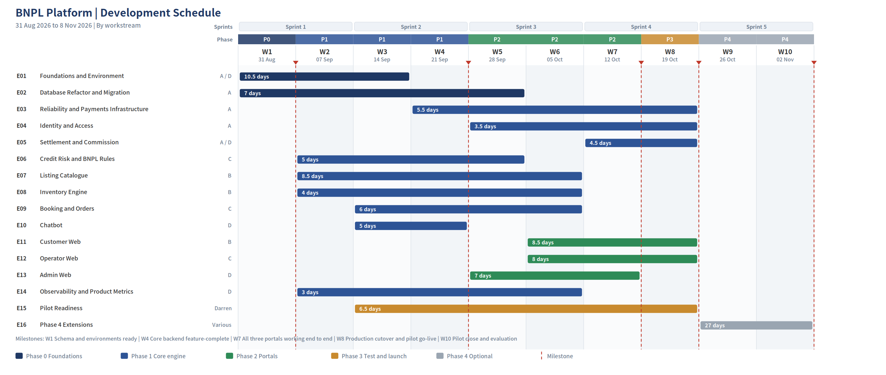

<!-- Extracted from SRS V2.4. Master copy is the DOCX; regenerate rather than hand-edit. -->

# 10. Development Plan

## 10.1 Development Window

Development runs from Monday 31 August 2026 to Sunday 8 November 2026, which is ten weeks. Earlier versions of this plan assumed eight. Confirming the actual dates is the single largest improvement available to this project, because it converts a schedule with no buffer into one where every member sits inside their capacity.

| Phase | Weeks | Dates | Objective | Deliverables |
| --- | --- | --- | --- | --- |
| Phase 0: Foundations | 1 | 31 Aug – 6 Sep | Database refactor, DigitalOcean environment, API contract, module skeleton, feature flags, job queue | Refactored schema, environments, published contract, development covenant |
| Phase 1: Core engine | 2–4 | 7 – 27 Sep | Reliability, credit risk, settlement, catalogue, inventory, booking, chatbot backend, instrumentation | Core backend APIs, unit tests, migration scripts, migration rehearsal |
| Phase 2: The three portals | 5–7 | 28 Sep – 18 Oct | Customer front end, operator back office, administration console, integration | Complete running web platform, integration report |
| Phase 3: Test and launch | 8 | 19 – 25 Oct | Acceptance testing, defect fixing, production cutover, pilot go-live | Live platform, trained operators, test evidence |
| Pilot and extensions | 9–10 | 26 Oct – 8 Nov | Live pilot operation and support. Optional: mobile, WhatsApp, reviews, favourites, pricing suggestions | Pilot results, evaluation evidence, whatever optional work the schedule allowed |

## 10.2 Effort and Capacity

The plan was decomposed into 88 stories with acceptance criteria, held in the development backlog. That decomposition produced a larger total than the earlier module-level estimate, and the difference is stated here rather than adjusted away.

| Measure | Value |
| --- | --- |
| Total across all phases | 119.5 person-days |
| Committed phases 0 to 3 (weeks 1 to 8) | 92.5 person-days |
| Optional work in weeks 9 and 10 | 27 person-days |
| Earlier module-level estimate for the same committed scope | 80 person-days |
| Gross availability, four members over eight weeks | 160 person-days |
| Required utilisation | About 58 percent, or roughly 2.9 working days per person per week |
| Heaviest single week for any member | 3.5 person-days |

The 12.5 day difference against the earlier estimate is not padding. It is work the earlier breakdown did not list: module scaffolding and the dependency lint rule, the job queue and worker, the tenant-aware database client, error tracking and structured logging, product event instrumentation, and the pilot readiness workstream in 9.5. All of it is necessary and all of it is now visible.

> Under the earlier eight-week assumption this scope required about 67 percent utilisation with no buffer, and two members were arithmetically over capacity. Spreading the same work across the real ten-week calendar resolves it without cutting anything.

## 10.3 Work Breakdown by Epic

The backlog groups the 88 stories into 16 epics. Story-level detail, acceptance criteria, dependencies and per-member checklists live in the backlog workbook; this table is the summary.

| Epic | Scope | Days | Owner | Weeks |
| --- | --- | --- | --- | --- |
| E01 Foundations and Environment | DigitalOcean environment, CI with a real database, API contract, module skeleton and lint rule, tenant client, job queue, feature flags | 10.5 | A / D / B | 1–3 |
| E02 Database Refactor and Migration | Schema V2.4, incremental migration, service date backfill, rehearsal against a production-sized snapshot, availability generation | 7 | A / B | 1–5 |
| E03 Reliability and Payments | Idempotency, webhook receiver, reconciliation sweep, cron advisory locks, audit log, error contract | 5.5 | A | 4–8 |
| E04 Identity and Access | Operator organisations and staff, token lifecycle with immediate revocation, row-level isolation, account security | 3.5 | A | 5–8 |
| E05 Settlement and Commission | Stripe Connect onboarding, commission ledger with both funding formulas, payout generation, operator reporting | 4.5 | A / D | 7–8 |
| E06 Credit Risk and BNPL Rules | Tier resolution, payment schedule generation, exposure cap, no-show and terminal outcomes, credit events and appeals, expiry sweep | 5 | C | 2–5 |
| E07 Listing Catalogue | Listings for both types, images, pricing rules, add-ons, locations, search, cancellation policies | 8.5 | B | 2–6 |
| E08 Inventory Engine | Daily availability, range-atomic reservation, release, concurrency evidence | 4 | B | 2–6 |
| E09 Booking and Orders | Booking orchestration, status lifecycle, cancellation and refunds, operator actions, promotions, attribution | 6 | C | 3–6 |
| E10 Chatbot | Rule engine, LLM fallback with circuit breaker, escalation and persistence | 5 | D | 3–4 |
| E11 Customer Web | Authentication, home, search, detail, booking and payment, personal centre | 8.5 | B | 6–8 |
| E12 Operator Web | Dashboard, orders with no-show marking, listings, inventory calendar, pricing, shop settings | 8 | C | 6–8 |
| E13 Admin Web | Overview, operator lifecycle, order control, appeal review, promotions, system settings | 7 | D | 5–7 |
| E14 Observability and Product Metrics | Error tracking and structured logging, event instrumentation, pilot metrics view | 3 | D | 2–6 |
| E15 Pilot Readiness | Legal publication, operator onboarding kit and bulk import, Stripe live mode, tax position, support model, operator recruitment, go-live | 6.5 | Lead / A | 3–8 |
| E16 Phase 4 Extensions | Reviews, favourites, mobile application, WhatsApp, SARIMA pricing, content operations | 27 | Various | 9–10 |

## 10.4 Allocation and Weekly Load

Each member owns a vertical slice from backend through to interface rather than a technical layer, so the person building a screen understands the data model beneath it and nobody waits for a layer to be finished.

| Member | Focus | Weeks 1–8 | Available | Variance |
| --- | --- | --- | --- | --- |
| A | Backend architecture, finance, deployment | 24.0 | 26.4 | +2.4 |
| B | Listing vertical and customer experience | 23.5 | 26.4 | +2.9 |
| C | Order and credit vertical, operator experience | 19.5 | 26.4 | +6.9 |
| D | Infrastructure, chatbot, administration, quality | 20.0 | 26.4 | +6.4 |
| Lead | Client relationship, pilot readiness, coordination | 5.5 | 15.8 | +10.3 |

| Member | W1 | W2 | W3 | W4 | W5 | W6 | W7 | W8 |
| --- | --- | --- | --- | --- | --- | --- | --- | --- |
| A | 3.0 | 3.0 | 2.5 | 3.0 | 3.0 | 3.0 | 3.0 | 3.5 |
| B | 2.0 | 2.5 | 3.0 | 3.0 | 3.0 | 3.5 | 3.0 | 3.5 |
| C | — | 1.0 | 2.0 | 2.5 | 3.5 | 3.5 | 3.5 | 3.5 |
| D | 3.0 | 2.0 | 1.5 | 3.5 | 2.5 | 3.0 | 2.5 | 2.0 |
| Lead | — | — | 0.5 | — | 1.0 | 1.5 | 1.5 | 1.0 |

Member A carries the critical path in week 1: the schema blocks every Phase 1 story and the API contract is what lets the other three build without waiting for an implementation. Member C has nothing to start in week 1 while the schema is being written, and should use that time to read the contract and plan the credit module.

> Two stories were reassigned during scheduling to relieve member B, who was the most loaded: cancellation policy configuration moved to C, and the operator onboarding kit and bulk import moved to the team lead.

## 10.5 Schedule

| Milestone | Date | Meaning |
| --- | --- | --- |
| End of week 1 | 4 Sep 2026 | Schema and environments ready. Everything else depends on this |
| End of week 4 | 25 Sep 2026 | Core backend feature-complete. The week 4 checkpoint is held here |
| End of week 7 | 16 Oct 2026 | All three portals working end to end |
| End of week 8 | 23 Oct 2026 | Production cutover and pilot go-live |
| End of week 10 | 6 Nov 2026 | Pilot close, exit criteria assessed, evaluation evidence collected |

## 10.6 Checkpoint and Contingency

- A checkpoint is held at the end of week 4 regardless of how the project is going. Input is the backlog burndown and the per-member weekly load
- Question: can Phase 2 realistically finish inside weeks 5 to 7 with the work remaining?
- First contingency: the chatbot backend moves to weeks 9 and 10. Nothing else depends on it and the rule engine layer alone can be demonstrated
- Second contingency: promotion codes, the visual pricing rule editor, marketing attribution reporting and saved listings come out of the committed scope. Roughly nine days, and none is needed for a booking to work end to end
- The decision is made in the meeting and recorded, not deferred to the following week

> The contingency list is retained even though the ten-week schedule is not expected to need it. A cut list agreed in advance, while nobody is behind, is a plan. The same decision taken in week 7 under pressure is a failure.

