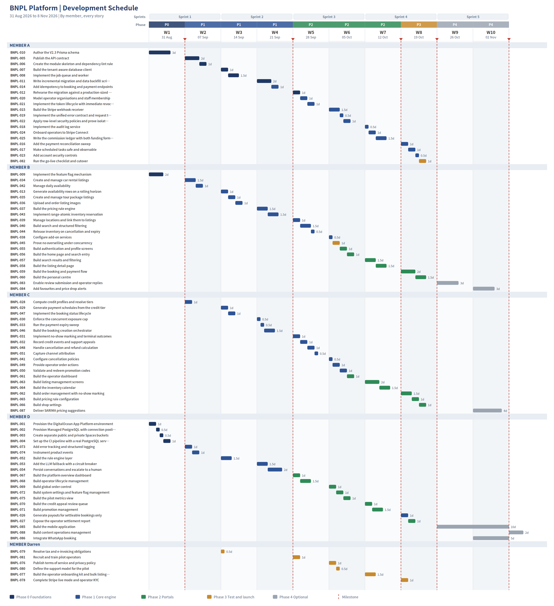

# Work Assignment Pack

# How to Use This

Each member has one section. It states what they own, what the rest of the team is waiting on from them, and an ordered list of what to build in which week. Every item names the outcome, so the person can tell whether they are finished without asking.

The detailed acceptance criteria live in the backlog spreadsheet, on the sheet named for that member, where each row has a tick box. This document is the briefing; that sheet is the tracker.

- Read your section top to bottom once before week 1. It takes five minutes and removes most of the questions
- Work down your list in order. The order encodes dependencies, not preference
- The "unblocks" column tells you who is waiting. If you are going to miss an item that unblocks someone, say so before the week ends, not after
- A story is not finished until every acceptance criterion in the spreadsheet passes and the definition of done in the Team Charter is met

> Weekly loads that exceed the capacity assumption are shown rather than smoothed over. Where a week is heavy, that is a real scheduling problem to solve at the Monday backlog check, not an estimate to argue with.

## The same schedule as a Gantt chart

The per-member view below, drawn as one chart. `docs/srs/10-development-plan.md` carries the summary version of the same schedule.

# Member A — Backend architecture, money, and production

You own the foundations everyone else builds on, and everything that touches money. Nobody can start Phase 1 until your schema lands in week 1, which makes you the critical path for the whole project. You also own the commission and settlement chain, where a defect is not a bug but a reconciliation failure.

**The team is waiting on you for:** Everyone. The schema (BNPL-010) blocks every Phase 1 story, and the API contract (BNPL-005) is what lets B, C and D build without waiting for your implementation. If either slips past week 1, the whole plan slips with it.

**Watch out for:** Week 1 is the schema and nothing else, because until it lands nobody can start Phase 1. It is three days in a week with about 3.3 available, so it fits, but only if you are left alone to do it. Rehearse the migration rather than discovering it live.

**Committed load, weeks 1 to 8:** 24 person-days against roughly 26 available

### Week 1   —   31 Aug – 04 Sep   —   3 days   (Sprint 1)

| Story | Build | Outcome when done | Days | Unblocks |
| --- | --- | --- | --- | --- |
| BNPL-010 | Author the V2.3 Prisma schema | integrity is enforced by the database rather than by application code | 3 | BNPL-011, BNPL-013, BNPL-018, BNPL-020, BNPL-028, BNPL-034, BNPL-052 |

### Week 2   —   07 Sep – 11 Sep   —   3 days   (Sprint 1)

| Story | Build | Outcome when done | Days | Unblocks |
| --- | --- | --- | --- | --- |
| BNPL-005 | Publish the API contract | I can build screens against a contract instead of waiting for the backend to finish | 2 | BNPL-019, BNPL-061, BNPL-067 |
| BNPL-006 | Create the module skeleton and dependency lint rule | cross-module table access is caught by the build rather than by review | 1 | BNPL-007, BNPL-008, BNPL-009 |

### Week 3   —   14 Sep – 18 Sep   —   2.5 days   (Sprint 2)

| Story | Build | Outcome when done | Days | Unblocks |
| --- | --- | --- | --- | --- |
| BNPL-007 | Build the tenant-aware database client | the tenant context can never be forgotten on a tenant-scoped query | 1 | BNPL-022 |
| BNPL-008 | Implement the job queue and worker | background work survives restarts and is never silently lost | 1.5 | BNPL-014, BNPL-015, BNPL-017, BNPL-074 |

### Week 4   —   21 Sep – 25 Sep   —   3 days   (Sprint 2)

| Story | Build | Outcome when done | Days | Unblocks |
| --- | --- | --- | --- | --- |
| BNPL-011 | Write incremental migration and data backfill scripts | the existing system's bookings and payments survive the refactor | 2 | BNPL-012 |
| BNPL-014 | Add idempotency to booking and payment endpoints | a slow network or a double tap does not cost me twice | 1 | — |

### Week 5   —   28 Sep – 02 Oct   —   3 days   (Sprint 3)

| Story | Build | Outcome when done | Days | Unblocks |
| --- | --- | --- | --- | --- |
| BNPL-012 | Rehearse the migration against a production-sized snapshot | we are not discovering migration problems during go-live | 1 | BNPL-082 |
| BNPL-020 | Model operator organisations and staff membership | my counter staff can process bookings without sharing my login | 1 | BNPL-021 |
| BNPL-021 | Implement the token lifecycle with immediate revocation | suspending an operator actually suspends them | 1 | BNPL-023, BNPL-055, BNPL-068 |

### Week 6   —   05 Oct – 09 Oct   —   3 days   (Sprint 3)

| Story | Build | Outcome when done | Days | Unblocks |
| --- | --- | --- | --- | --- |
| BNPL-015 | Build the Stripe webhook receiver | no payment is lost and no event is processed twice | 1.5 | BNPL-016, BNPL-024 |
| BNPL-019 | Implement the unified error contract and request tracing | I can branch on a code and trace an error back to a server log | 0.5 | BNPL-073 |
| BNPL-022 | Apply row-level security policies and prove isolation | a coding mistake cannot expose one operator's data to another | 1 | — |

### Week 7   —   12 Oct – 16 Oct   —   3 days   (Sprint 4)

| Story | Build | Outcome when done | Days | Unblocks |
| --- | --- | --- | --- | --- |
| BNPL-018 | Implement the audit log service | data changes can be traced and responsibility established | 0.5 | — |
| BNPL-024 | Onboard operators to Stripe Connect | money from my bookings reaches me automatically | 1 | BNPL-025, BNPL-078 |
| BNPL-025 | Write the commission ledger with both funding formulas | the ledger reconciles against Stripe line by line | 1.5 | BNPL-026 |

### Week 8   —   19 Oct – 23 Oct   —   3.5 days   (Sprint 4)

| Story | Build | Outcome when done | Days | Unblocks |
| --- | --- | --- | --- | --- |
| BNPL-016 | Add the payment reconciliation sweep | a lost callback does not leave a paid booking marked unpaid | 1 | — |
| BNPL-017 | Make scheduled tasks safe and observable | expired bookings are never cancelled twice or missed entirely | 1 | — |
| BNPL-023 | Add account security controls | someone cannot brute force their way into my bookings | 0.5 | — |
| BNPL-082 | Run the go-live checklist and cutover | go-live is an event we planned rather than survived | 1 | — |

# Member B — The listing vertical and the customer experience

You own a customer's entire journey, from how an operator publishes a vehicle through to how a customer finds and books it. You build the backend and then the interface on top of it, so you understand the data model behind every screen you make. Your inventory work is the single correctness guarantee the platform makes to operators.

**The team is waiting on you for:** C cannot build booking creation (BNPL-046) until your inventory reservation (BNPL-043) exists. Operators cannot be recruited (BNPL-081) until listing management and bulk import work.

**Watch out for:** You carry the largest total at 23.5 days. Two of your original stories moved to relieve you: BNPL-041 to C and BNPL-077 to Darren. Weeks 6 and 8 are your heaviest at 3.5 days. Your Phase 4 work in weeks 9 and 10 is optional and should be cut before anything committed slips.

**Committed load, weeks 1 to 8:** 23.5 person-days against roughly 26 available

### Week 1   —   31 Aug – 04 Sep   —   2 days   (Sprint 1)

| Story | Build | Outcome when done | Days | Unblocks |
| --- | --- | --- | --- | --- |
| BNPL-009 | Implement the feature flag mechanism | incomplete work can be merged without appearing in a demonstration | 2 | BNPL-072 |

### Week 2   —   07 Sep – 11 Sep   —   2.5 days   (Sprint 1)

| Story | Build | Outcome when done | Days | Unblocks |
| --- | --- | --- | --- | --- |
| BNPL-034 | Create and manage car rental listings | customers can find and understand what they are booking | 1.5 | BNPL-035, BNPL-037, BNPL-038, BNPL-039, BNPL-041, BNPL-063 |
| BNPL-042 | Manage daily availability | I do not accept bookings for vehicles that are already out | 1 | BNPL-043, BNPL-064 |

### Week 3   —   14 Sep – 18 Sep   —   3 days   (Sprint 2)

| Story | Build | Outcome when done | Days | Unblocks |
| --- | --- | --- | --- | --- |
| BNPL-013 | Generate availability rows on a rolling horizon | I do not have to configure every future date by hand | 1 | BNPL-040, BNPL-042 |
| BNPL-035 | Create and manage tour package listings | customers understand what the package covers before booking | 1 | — |
| BNPL-036 | Upload and order listing images | my listing looks credible to a customer who has never heard of my company | 1 | — |

### Week 4   —   21 Sep – 25 Sep   —   3 days   (Sprint 2)

| Story | Build | Outcome when done | Days | Unblocks |
| --- | --- | --- | --- | --- |
| BNPL-037 | Build the pricing rule engine | I can charge what the market bears without editing every listing daily | 1.5 | BNPL-065 |
| BNPL-043 | Implement range-atomic inventory reservation | two customers can never be sold the same vehicle for overlapping dates | 1.5 | BNPL-044, BNPL-045, BNPL-046 |

### Week 5   —   28 Sep – 02 Oct   —   3 days   (Sprint 3)

| Story | Build | Outcome when done | Days | Unblocks |
| --- | --- | --- | --- | --- |
| BNPL-039 | Manage locations and link them to listings | I do not retype the same address on every listing | 1 | — |
| BNPL-040 | Build search and structured filtering | I can find a seven-seat automatic in Kuching without scrolling through everything | 1.5 | BNPL-056 |
| BNPL-044 | Release inventory on cancellation and expiry | a lapsed booking does not block a real one | 0.5 | — |

### Week 6   —   05 Oct – 09 Oct   —   3.5 days   (Sprint 3)

| Story | Build | Outcome when done | Days | Unblocks |
| --- | --- | --- | --- | --- |
| BNPL-038 | Configure add-on services | I can increase revenue per booking | 0.5 | — |
| BNPL-045 | Prove no overselling under concurrency | we can defend the claim at the project viva | 1 | — |
| BNPL-055 | Build authentication and profile screens | I can use the platform and keep my information current | 1 | BNPL-076 |
| BNPL-056 | Build the home page and search entry | I can find what I need without learning the site | 1 | BNPL-057 |

### Week 7   —   12 Oct – 16 Oct   —   3 days   (Sprint 4)

| Story | Build | Outcome when done | Days | Unblocks |
| --- | --- | --- | --- | --- |
| BNPL-057 | Build search results and filtering | I do not have to open twenty listings to compare | 1.5 | BNPL-058 |
| BNPL-058 | Build the listing detail page | I know what is included and what happens if I cancel | 1.5 | BNPL-083 |

### Week 8   —   19 Oct – 23 Oct   —   3.5 days   (Sprint 4)

| Story | Build | Outcome when done | Days | Unblocks |
| --- | --- | --- | --- | --- |
| BNPL-059 | Build the booking and payment flow | I am never surprised by a second deadline | 2 | BNPL-060 |
| BNPL-060 | Build the personal centre | I can manage what I have booked and understand my standing | 1.5 | BNPL-084, BNPL-085 |

### Weeks 9 and 10: live pilot and optional work

- Week 9: BNPL-083 Enable review submission and operator replies (3 days)
- Week 10: BNPL-084 Add favourites and price drop alerts (3 days)

Weeks 9 and 10 run the live pilot. These items are delivered only if weeks 1 to 8 finished on plan, and are cut from the bottom of the list rather than compressed. Supporting the running pilot takes precedence over all of them.

# Member C — The order and credit vertical, and the operator experience

You own the booking lifecycle and the credit system, which is the part of this project with real academic novelty. You also build the back office the operators actually spend their day in. If the credit tiering works, that is your result to present.

**The team is waiting on you for:** D cannot build the appeal review queue (BNPL-070) until credit events (BNPL-032) exist. Nothing in the pilot works without booking creation.

**Watch out for:** You have nothing to start in week 1 while waiting on the schema. Use it to read the API contract and plan the credit module rather than idling. Credit appeals (BNPL-032) must not slip past week 5, because D's appeal queue depends on it and it is your report evidence.

**Committed load, weeks 1 to 8:** 19.5 person-days against roughly 26 available

### Week 2   —   07 Sep – 11 Sep   —   1 days   (Sprint 1)

| Story | Build | Outcome when done | Days | Unblocks |
| --- | --- | --- | --- | --- |
| BNPL-028 | Compute credit profiles and resolve tiers | payment terms reflect actual reliability | 1 | BNPL-029 |

### Week 3   —   14 Sep – 18 Sep   —   2 days   (Sprint 2)

| Story | Build | Outcome when done | Days | Unblocks |
| --- | --- | --- | --- | --- |
| BNPL-029 | Generate payment schedules from the credit tier | I know exactly what is due and when | 1 | BNPL-030, BNPL-031, BNPL-033 |
| BNPL-047 | Implement the booking status lifecycle | disputes can be resolved by looking at the record | 1 | BNPL-048, BNPL-049, BNPL-069 |

### Week 4   —   21 Sep – 25 Sep   —   2.5 days   (Sprint 2)

| Story | Build | Outcome when done | Days | Unblocks |
| --- | --- | --- | --- | --- |
| BNPL-030 | Enforce the concurrent exposure cap | a new account cannot occupy my inventory across many bookings at once | 0.5 | — |
| BNPL-033 | Run the payment expiry sweep | my inventory is released rather than held indefinitely | 0.5 | — |
| BNPL-046 | Build the booking creation orchestrator | I get a confirmed booking and a clear payment schedule | 1.5 | BNPL-047, BNPL-050, BNPL-051, BNPL-059 |

### Week 5   —   28 Sep – 02 Oct   —   3.5 days   (Sprint 3)

| Story | Build | Outcome when done | Days | Unblocks |
| --- | --- | --- | --- | --- |
| BNPL-031 | Implement no-show marking and terminal outcomes | I am compensated for inventory I held and the customer's record reflects it | 1 | BNPL-032 |
| BNPL-032 | Record credit events and support appeals | a mistaken no-show does not permanently damage my standing | 1 | BNPL-070 |
| BNPL-048 | Handle cancellation and refund calculation | I am not surprised by the refund amount | 1 | — |
| BNPL-051 | Capture channel attribution | we can tell what marketing spend actually worked | 0.5 | — |

### Week 6   —   05 Oct – 09 Oct   —   3.5 days   (Sprint 3)

| Story | Build | Outcome when done | Days | Unblocks |
| --- | --- | --- | --- | --- |
| BNPL-041 | Configure cancellation policies | refund amounts are calculated rather than argued about | 0.5 | BNPL-066 |
| BNPL-049 | Provide operator order actions | I can clear a morning's bookings quickly | 1 | BNPL-062 |
| BNPL-050 | Validate and redeem promotion codes | I benefit from a campaign I was sent | 1 | BNPL-071 |
| BNPL-061 | Build the operator dashboard | I know what needs attention this morning | 1 | — |

### Week 7   —   12 Oct – 16 Oct   —   3.5 days   (Sprint 4)

| Story | Build | Outcome when done | Days | Unblocks |
| --- | --- | --- | --- | --- |
| BNPL-063 | Build listing management screens | I can get my inventory onto the platform | 2 | BNPL-077 |
| BNPL-064 | Build the inventory calendar | I can block a day when a vehicle goes for service | 1.5 | — |

### Week 8   —   19 Oct – 23 Oct   —   3.5 days   (Sprint 4)

| Story | Build | Outcome when done | Days | Unblocks |
| --- | --- | --- | --- | --- |
| BNPL-062 | Build order management with no-show marking | my day's work happens in one screen | 1.5 | — |
| BNPL-065 | Build pricing rule configuration | I do not need a developer to change my rates | 1 | — |
| BNPL-066 | Build shop settings | the platform reflects how my business actually works | 1 | — |

### Weeks 9 and 10: live pilot and optional work

- Week 10: BNPL-087 Deliver SARIMA pricing suggestions (4 days)

Weeks 9 and 10 run the live pilot. These items are delivered only if weeks 1 to 8 finished on plan, and are cut from the bottom of the list rather than compressed. Supporting the running pilot takes precedence over all of them.

# Member D — Infrastructure, support surfaces, and knowing whether it worked

You own the environments everyone deploys to, the chatbot, the administration console, and the measurement without which we cannot say whether the pilot succeeded. You also lead testing, which means you are the last line before a defect reaches a real customer.

**The team is waiting on you for:** Everyone deploys to environments you build in week 1. The whole team's test evidence and the pilot metrics depend on your instrumentation (BNPL-074).

**Watch out for:** Your core load is the most evenly spread, which makes you the place to absorb overflow. Guard BNPL-074 specifically: if instrumentation slips past week 2 the pilot runs blind and the evaluation chapter has no data. Your weeks 9 and 10 are heavily overloaded with optional work, which is expected; cut from the bottom.

**Committed load, weeks 1 to 8:** 20 person-days against roughly 26 available

### Week 1   —   31 Aug – 04 Sep   —   3 days   (Sprint 1)

| Story | Build | Outcome when done | Days | Unblocks |
| --- | --- | --- | --- | --- |
| BNPL-001 | Provision the DigitalOcean App Platform environment | requests stay same-origin and there is one place to configure the deployment | 1 | BNPL-002, BNPL-003 |
| BNPL-002 | Provision Managed PostgreSQL with connection pooling | the application does not exhaust the connection limit and RLS context works correctly | 0.5 | BNPL-004, BNPL-010 |
| BNPL-003 | Create separate public and private Spaces buckets | a customer identity document is never reachable from a guessable URL | 0.5 | BNPL-036 |
| BNPL-004 | Set up the CI pipeline with a real PostgreSQL service | database-level guarantees such as constraints and RLS are actually exercised | 1 | BNPL-006 |

### Week 2   —   07 Sep – 11 Sep   —   2 days   (Sprint 1)

| Story | Build | Outcome when done | Days | Unblocks |
| --- | --- | --- | --- | --- |
| BNPL-073 | Add error tracking and structured logging | I can diagnose a production problem without a customer describing it | 1 | — |
| BNPL-074 | Instrument product events | we can measure whether the pilot worked instead of guessing | 1 | BNPL-075 |

### Week 3   —   14 Sep – 18 Sep   —   1.5 days   (Sprint 2)

| Story | Build | Outcome when done | Days | Unblocks |
| --- | --- | --- | --- | --- |
| BNPL-052 | Build the rule engine layer | I do not wait for a human to tell me my payment deadline | 1.5 | BNPL-053 |

### Week 4   —   21 Sep – 25 Sep   —   3.5 days   (Sprint 2)

| Story | Build | Outcome when done | Days | Unblocks |
| --- | --- | --- | --- | --- |
| BNPL-053 | Add the LLM fallback with a circuit breaker | I am not stuck when my question is slightly unusual | 1.5 | BNPL-054 |
| BNPL-054 | Persist conversations and escalate to a human | a customer problem does not disappear | 2 | — |

### Week 5   —   28 Sep – 02 Oct   —   2.5 days   (Sprint 3)

| Story | Build | Outcome when done | Days | Unblocks |
| --- | --- | --- | --- | --- |
| BNPL-067 | Build the platform overview dashboard | I can spot a problem before an operator reports it | 1 | BNPL-088 |
| BNPL-068 | Build operator lifecycle management | only legitimate businesses trade on the platform | 1.5 | — |

### Week 6   —   05 Oct – 09 Oct   —   3 days   (Sprint 3)

| Story | Build | Outcome when done | Days | Unblocks |
| --- | --- | --- | --- | --- |
| BNPL-069 | Build global order control | a stuck booking can be resolved without database access | 1 | — |
| BNPL-072 | Build system settings and feature flag management | we can tune the platform during the pilot | 1 | — |
| BNPL-075 | Build the pilot metrics view | we can run a weekly review without writing SQL | 1 | BNPL-087 |

### Week 7   —   12 Oct – 16 Oct   —   2.5 days   (Sprint 4)

| Story | Build | Outcome when done | Days | Unblocks |
| --- | --- | --- | --- | --- |
| BNPL-070 | Build the credit appeal review queue | a customer wrongly marked is not permanently penalised | 1 | — |
| BNPL-071 | Build promotion management | we can run promotions without engineering help | 1.5 | — |

### Week 8   —   19 Oct – 23 Oct   —   2 days   (Sprint 4)

| Story | Build | Outcome when done | Days | Unblocks |
| --- | --- | --- | --- | --- |
| BNPL-026 | Generate payouts for settleable bookings only | the platform is not exposed to chargebacks on money it has already released | 1 | BNPL-027 |
| BNPL-027 | Expose the operator settlement report | I can verify the platform's arithmetic myself | 1 | — |

### Weeks 9 and 10: live pilot and optional work

- Week 9: BNPL-085 Build the mobile application (10 days)
- Week 9: BNPL-088 Build content operations management (2 days)
- Week 10: BNPL-086 Integrate WhatsApp booking (5 days)

Weeks 9 and 10 run the live pilot. These items are delivered only if weeks 1 to 8 finished on plan, and are cut from the bottom of the list rather than compressed. Supporting the running pilot takes precedence over all of them.

# Darren (Team Lead) — Team lead, client relationship, and pilot readiness

You own everything that makes a pilot possible but is not code: the client decisions, the operators themselves, the legal and tax questions, and the support model. Five of these depend on other people responding, so starting late is the main way they fail.

**The team is waiting on you for:** The team cannot finalise settlement configuration without the commission rate, cannot build screens without a language decision, and cannot run a pilot without operators. Your items unblock other people rather than the reverse.

**Watch out for:** Operator recruitment (BNPL-081) in week 5 is the item most likely to sink the pilot and the one you control least. Stripe onboarding (BNPL-078) depends on operators existing, so a slip in week 5 cascades into week 8. If operators are not confirmed by end of week 5, raise it formally rather than hoping.

**Committed load, weeks 1 to 8:** 5.5 person-days against roughly 26 available

### Week 3   —   14 Sep – 18 Sep   —   0.5 days   (Sprint 2)

| Story | Build | Outcome when done | Days | Unblocks |
| --- | --- | --- | --- | --- |
| BNPL-079 | Resolve tax and e-invoicing obligations | the pilot does not create a tax liability nobody planned for | 0.5 | — |

### Week 5   —   28 Sep – 02 Oct   —   1 days   (Sprint 3)

| Story | Build | Outcome when done | Days | Unblocks |
| --- | --- | --- | --- | --- |
| BNPL-081 | Recruit and train pilot operators | the pilot has supply before it seeks demand | 1 | — |

### Week 6   —   05 Oct – 09 Oct   —   1.5 days   (Sprint 3)

| Story | Build | Outcome when done | Days | Unblocks |
| --- | --- | --- | --- | --- |
| BNPL-076 | Publish terms of service and privacy policy | we are not collecting personal data without a lawful basis | 1 | — |
| BNPL-080 | Define the support model for the pilot | a failed payment does not become an abandoned customer | 0.5 | — |

### Week 7   —   12 Oct – 16 Oct   —   1.5 days   (Sprint 4)

| Story | Build | Outcome when done | Days | Unblocks |
| --- | --- | --- | --- | --- |
| BNPL-077 | Build the operator onboarding kit and bulk listing import | the platform is worth joining | 1.5 | BNPL-081 |

### Week 8   —   19 Oct – 23 Oct   —   1 days   (Sprint 4)

| Story | Build | Outcome when done | Days | Unblocks |
| --- | --- | --- | --- | --- |
| BNPL-078 | Complete Stripe live mode and operator KYC | the pilot can move real money | 1 | — |

# What Changed When We Put It On a Calendar

The plan was originally written against an eight-week assumption. The actual window, 31 August to 8 November 2026, is ten weeks. That difference is worth more to this project than any other single change available to it.

| Item | Eight-week assumption | Actual ten-week window |
| --- | --- | --- |
| Phase 1, core engine | Two weeks for 43 days of work | Three weeks, W2 to W4 |
| Phase 2, the three portals | Two weeks for 25.5 days of work | Three weeks, W5 to W7 |
| Phase 3, test and go-live | Week 6, alongside the tail of Phase 2 | Week 8, on its own |
| Pilot operation | Effectively none. Go-live was the finish line | Two weeks live, W9 and W10, which is what makes the exit criteria reachable |
| Required utilisation | About 67 percent, with no buffer | About 58 percent, with every member under capacity |
| Heaviest single week | Member B at 6 days | Member B at 3.5 days |

> The pre-agreed cut list in the Team Charter has not been deleted. It is simply no longer expected to be needed, which is a better position to hold it from. The week 4 checkpoint still happens.

## Two things still worth watching

- Weeks 9 and 10 are the live pilot. Phase 4 work scheduled there is genuinely optional, and members B, C and D are all over capacity in those weeks by design. Supporting real operators and real customers comes first; the mobile app comes last
- Darren’s week 5 item, recruiting the pilot operators, is the one dependency the team cannot solve by working harder. If operators are not confirmed by the end of week 5, Stripe onboarding cannot start, and week 8 go-live becomes a demonstration rather than a pilot

